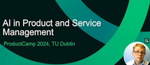
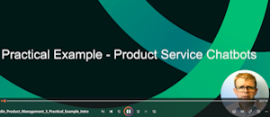
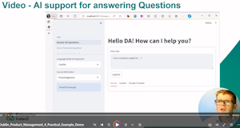
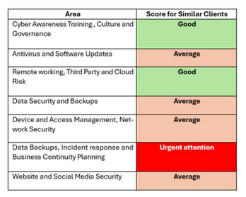

## Most Recent Book - AI and Business Rules for Excel Power Users

This GibHub code repository for [AI and Business Rules for Excel Power Users](https://www.packtpub.com/product/ai-and-business-rule-engines-for-excel-power-users/9781804619544), published by Packt, [can be found here](https://github.com/PacktPublishing/AI-and-Business-Rules-for-Excel-Power-Users?tab=readme-ov-file)

  
<!-- Videos -->
## AI and Product Management Series

Excerpts from talks on AI on Product Management and related topics. Click on image to play video.

| **AI and Product Management- Bio an Intro** | **How AI needs Product Management (and Vice Versa)** | **A practical example of this in action**  | **Product Demo**  | **Takeaways and Lessons Learned**|
|---|---|---|---|---|
|   |   |    |   |   |

 

## Video Walk through - Spec Driven Development, 100% accurate AI using Business rules
Source code and more information https://github.com/paulbrowne-irl/Auto-generate_Business_Rules/

Walk through on Video (opens in YouTube) 

 

## Other AI Presentations
  * [Public PDF - Scoring 1000 Irish Companies Cyber Readiness using AI and Natural Language Processing](https://drive.google.com/file/d/1iCZAC-b9lOSB0BngH1FHhEbwVYdt8Nxo) 

 

## Highlighted projects

Click on the _Pinned_ Projects in the section below to view more details.
  * __Red Piranha__ - AI for financial decision making (e.g. loans or buisness grant applications), the focus of the first book.</li>
  * __AI Emails and Documents__ - automatic drafting of emails for a helpdesk (e.g. on Cyber grants)</li>
  * __Smart Document Analysis__ - scoring of thousands of clients based on hundreds of thousands of documents (e.g. for Cyber Maturity - see above presentation).
  *  __EAR Mailbox__ - scripts for extracting data and statistic from a shared enterprise mailbox (e.g. respond to client client queries)
  * __Redact_anonymise_documents__ - Public version of scripts to anonmyise personal and company info from a folder of word and pdf docs.
 
