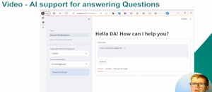

## Most Recent Book - AI and Business Rules for Excel Power Users

This GibHub code repository for [AI and Business Rules for Excel Power Users](https://www.packtpub.com/product/ai-and-business-rule-engines-for-excel-power-users/9781804619544), published by Packt, [can be found here](https://github.com/PacktPublishing/AI-and-Business-Rules-for-Excel-Power-Users?tab=readme-ov-file)

<!-- Videos -->
## AI and Product Management Series

Excerpts from talks on AI on Product Management and related topics. Click on image to play video.

| **AI and Product Management- Bio an Intro** | **How AI needs Product Management (and Vice Versa)** | **A practical example of this in action**  | **Product Demo**  | **Takeaways and Lessons Learned**|
|---|---|---|---|---|
|   |   |    |   |   |

## Other Highlighted projects

Some Other Highlighted Projects

<!--
Bring in
* Linkedin to profile https://www.linkedin.com/in/paulbrowne/
* Host Videos and powerpoint
* Link Blog -https://paulbrowne-irl.github.io/blog/

Idea
* https://www.linkedin.com/pulse/how-glitz-up-your-github-profile-advance-career-github-efyxc/
* https://github.com/LadyKerr/profilereadme
* https://github.com/kautukkundan/Awesome-Profile-README-templates
* https://docs.github.com/en/codespaces/setting-up-your-project-for-codespaces/setting-up-your-repository/facilitating-quick-creation-and-resumption-of-codespaces
-->

<!--
## About Me (in progress) 🚀

I'm a passionate **[Your Job Title / Developer Role]** with experience in **[technologies you're proficient in]**. I love tackling complex problems, learning new skills, and collaborating with diverse teams to create innovative solutions.

- 🌱 Currently learning: **[new technologies or skills you're currently learning]**
- 🔭 Working on: **[current projects or side-projects]**
- 🌍 Languages: **[programming languages and human languages you speak]**
- 📫 How to reach me: **[your email address or other contact information]**
- ⚡ Fun fact: **[a fun fact about yourself]**

## My Skills 🧠

*Replace the above skill badges with your own skills and expertise. To create more badges, use [checkout this repo](https://github.com/alexandresanlim/Badges4-README.md-Profile).*

## Featured Projects 💻

### [Project 1 Title](project_1_link)

**[Project 1 Title]** is a **[brief project description]** built with **[technologies used]**. This project demonstrates my ability to **[skills demonstrated by the project]**. You can check out the repository [here](project_1_repository_link).

### [Project 2 Title](project_2_link)

**[Project 2 Title]** is a **[brief project description]** built with **[technologies used]**. This project showcases my skills in **[skills demonstrated by the project]**. You can check out the repository [here](project_2_repository_link).
-->
